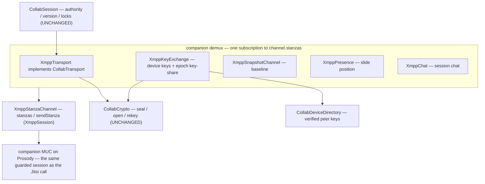

# OciDeck — XMPP CollabTransport: the collaboration data plane on the XMPP spine (Design)

> **Status:** design proposal — unbuilt (slice 2 of NATIVE_CALLS §7.1) · **Status last reviewed:** 2026-08-08 · **Published by:** Stichting LibreKAT

> **A design proposal — not yet implemented.**
> This spells out **one buildable slice**: `XmppTransport implements CollabTransport`,
> the OciDeck data plane (ops, locks, presence, chat, baseline) carried over the
> **companion MUC** on the XMPP spine, so co-authoring runs on the same connection as
> the Jitsi call instead of on Matrix.
>
> It is written to be **picked up cold**: exact seams, wire shapes, the Matrix→XMPP
> mapping, the security posture, the test harness, and the open questions are spelled
> out against files that exist today.
>
> **Siblings.** [`NATIVE_CALLS.md`](NATIVE_CALLS.md) §5 decides the single XMPP spine and
> §5.1 the companion channel; this is its data-plane §5 counterpart (that doc's remaining
> **slice 2**, §7.1). [`SELF_ENCRYPTED_RELAY.md`](SELF_ENCRYPTED_RELAY.md) is the Matrix-mode
> data plane this mirrors brick-for-brick. [`COLLABORATION.md`](COLLABORATION.md) defines the
> `CollabTransport` seam and the authority/version/lock rules that stay **unchanged** underneath.
>
> **Gated.** No new dependency: carriage is `package:xml` + `package:crypto` (both already in
> `pubspec`); crypto is `CollabCrypto`, reused verbatim. Implementation must still clear the
> [`ketenkeuring-xmpp-spine.md`](../../assurance/ketenkeuring-xmpp-spine.md) build-conditions and a
> bewaker + security-architect review before it lands (it touches outbound traffic, keys, and a
> trust boundary).

---

## 1. What this slice is (and is not)

**Is:** wiring the *existing* collaboration engine to run over XMPP. `collab_session.dart`
(authority, version rule, slide locks) already drives any `CollabTransport`; today the real
remote implementation is `MatrixRelayTransport`. This slice adds a second real implementation,
`XmppTransport`, plus the lifecycle bricks it needs (keying, snapshot, presence, chat), so a
session can run **entirely on XMPP** — the companion MUC beside a Jitsi call, or standalone.

**Is not:** the Jitsi media join (that is slice 1, F3.4b), and it is not new cryptography or a
new session engine. The thesis, proven by reading the Matrix stack, is narrow:

> **Only the carriage changes.** `CollabCrypto` (seal/open/rekey/wrap/install), `CollabSession`,
> `CollabSnapshot`, the trust store and the device directory are protocol-neutral. Matrix carries
> sealed envelopes as room **events** and keys as **to-device** messages; XMPP carries the same
> sealed envelopes as MUC **`<message>`** stanzas and keys as **directed MUC messages**. Swap the
> pipe, keep everything above it.

Because the two are interchangeable behind the seam, **this slice is also what lets
`MatrixRelayTransport` be parked** (NATIVE_CALLS §7.1): once `XmppTransport` carries the data
plane, Matrix mode becomes one optional backend rather than the only remote one.

---

## 2. The reference stack (what we are mirroring)

`matrix_session_launch.dart` assembles six protocol-neutral-plus-carriage bricks that share
**one sync loop** (the transport owns it and fans out by event type):

| Brick | Carries | Matrix carriage | Crypto |
|---|---|---|---|
| `MatrixRelayTransport` (`CollabTransport`) | ops, locks | timeline events `nl.ocideck.op` / `.lock` (sealed) | `seal`/`open` |
| `MatrixKeyExchange` | device keys, epoch keys | device keys as **room state** `nl.ocideck.device`; epoch key as **to-device** `nl.ocideck.keyshare` | `rekey`/`wrapEpochTo`/`installEpochKey` |
| `MatrixSnapshotChannel` | the baseline deck | timeline events (chunked, sealed) | `seal`/`open` |
| `MatrixPresence` | who-is-on-which-slide | room state `nl.ocideck.presence` (replacing) | `seal`/`open` |
| `MatrixChat` | chat | timeline events `nl.ocideck.chat` (sealed + **signed**) | `seal`/`open` |
| `MatrixDeviceDirectory` | verified peer keys | in-memory; ingests device state | `verifyBinding` |

Trust anchor in all of them: the sender is **inside the sealed envelope** (`senderDevice`),
verified against the directory-held keys — never the transport's `from`. A hostile relay can
withhold or reorder but cannot forge, and the version rule tolerates withhold/reorder. Everything
is **fail-closed**: malformed / forged / not-yet-openable is logged and dropped, never applied.

---

## 3. The wire on XMPP

**Home:** the companion MUC (`companion_room.dart`, `ocideck-<hash>@conference.<domain>`,
NATIVE_CALLS §5.1). All OciDeck occupants join it; non-OciDeck Jitsi participants are not in it.

**Envelope on the wire.** `SealedEnvelope.toContent()` is already a JSON-able `Map<String,Object?>`
(and `fromContent` its inverse). So each payload rides as **one child element carrying
`json.encode(sealed.toContent())` as its text**, in an `nl.ocideck.*` namespace — no new
serialization, the crypto's own encoding travels unchanged:

```
<message type="groupchat" to="ocideck-<hash>@conference.example.org">
  <op xmlns="nl.ocideck.op">{"v":1,"ct":"…","sig":"…","sender_device":"…"}</op>
</message>
```

| Data | Stanza | Element | Semantics |
|---|---|---|---|
| op | `<message type=groupchat>` to room | `<op xmlns="nl.ocideck.op">` | ordered by the room; version rule applies |
| lock | `<message type=groupchat>` to room | `<lock xmlns="nl.ocideck.lock">` | shares the send-chain with ops |
| chat | `<message type=groupchat>` to room | `<chat xmlns="nl.ocideck.chat">` | sealed **and signed**; accumulates |
| presence (slide) | `<message type=groupchat>` to room | `<pos xmlns="nl.ocideck.presence">` | latest-per-sender wins |
| snapshot chunk | `<message type=groupchat>` to room | `<snap xmlns="nl.ocideck.snapshot">` | reassembled baseline |
| device keys | `<presence>` to room, on join + rotation | `<x xmlns="nl.ocideck.device">` | retained per-occupant; newcomers get all |
| epoch key-share | **directed** `<message type=chat>` to `room/nick` | `<keyshare xmlns="nl.ocideck.keyshare">` | authority → one recipient |

Two carriage facts do the heavy lifting:

- **Groupchat gives a single consistent order.** A MUC reflects every occupant's groupchat
  message to all occupants in one room-serialized order — the equivalent of Matrix's canonical
  timeline. So the ops stream needs no sequence bookkeeping here either; the version rule (one
  layer up) already tolerates the rest.
- **Presence is retained, per-occupant state that newcomers receive.** On join the server sends a
  newcomer **every occupant's current presence**. That is the natural stand-in for Matrix's
  per-device room state: **device keys ride the companion-room presence**, so a joiner learns
  every peer's keys from the presences it receives at join — no PubSub node, no central registry.



---

## 4. The one structural change: push, not pull

Matrix is **pull** — the transport runs a periodic `syncOnce()` against a since-token and fans
out each batch. XMPP is **push** — `XmppStanzaChannel.stanzas` is a live broadcast stream that
completes when the stream drops. So the shape changes in exactly one place:

- **No sync loop, no since-token.** One **companion demux** owns a single `channel.stanzas`
  subscription and routes by stanza kind + child namespace to the transport / key-exchange /
  snapshot / presence / chat. (`stanzas` is broadcast, so `XmppMuc`'s own roster subscription
  coexists; `XmppMuc` stays payload-agnostic — the demux, not the MUC, reads `nl.ocideck.*`.)
- **Retry is event-driven, not round-driven.** The Matrix `_deferred` backlog (events that
  arrived before the sender's device key or the epoch key) is kept, but it is drained on a
  **key-state change** (a new device presence ingested, or an epoch key installed) instead of on
  each sync round. Same fail-closed bounds (`_maxDeferred`, `_maxDeferralRounds`).
- **Own-echo suppression is identical.** The MUC reflects your own groupchat back; drop it on
  `sealed.senderDevice == crypto.deviceId`, exactly as Matrix does.
- **Send ordering is kept.** Retain the serial send-chain (`_serializeSend`): seal + `sendStanza`
  are async, and two racing sends could reflect out of order and trip the follower's `version+1`
  rule (#1040).

---

## 5. The bricks to build

All new files live in `lib/xmpp/` (carriage) or reuse `lib/collab/` (engine). None touch
`CollabCrypto`, `CollabSession`, `CollabSnapshot` or the trust store.

1. **`xmpp_transport.dart` — `XmppTransport implements CollabTransport`.** `participantId =
   crypto.deviceId`; `sendOp`/`setLock` seal (ops signed when `version>0`, per the Matrix
   precedent) and send a groupchat `<message>`; the demux feeds inbound ops/locks to `ops`/`locks`
   after opening. Carries the deferred backlog and the serial send-chain.
2. **`xmpp_key_exchange.dart` — `XmppKeyExchange`.** `publishDeviceKeys()` → attach
   `<x xmlns="nl.ocideck.device">` to the companion-room presence; `handleDevicePresence()` →
   ingest a peer's keys from its presence into the directory (binding-verified);
   `distributeEpoch()` / `ensureKeyed()` → `wrapEpochTo` each peer and send a **directed**
   `<message to="room/nick">` key-share; `handleKeyshare()` → `installEpochKey`, verifying against
   the **directory-held** sender identity, never the message's. Crypto calls are identical to
   `MatrixKeyExchange`; only carriage differs.
3. **`xmpp_snapshot.dart` — `XmppSnapshotChannel`.** Chunk + seal the baseline into groupchat
   `<snap>` messages; reassemble + open on the joiner; buffer until the epoch key installs
   (`retryPending`). Mirrors `MatrixSnapshotChannel`.
4. **`xmpp_presence_beacon.dart` — `XmppPresence`.** Seal the current slide-id into a groupchat
   `<pos>` message; keep latest-per-sender. (Named `*_beacon` to avoid confusion with XMPP
   presence stanzas.)
5. **`xmpp_chat.dart` — `XmppChat`.** Seal **and sign** a chat line into a groupchat `<chat>`
   message; accumulate; drop a bad signature fail-closed. This is the §5.2 default: OciDeck-only,
   E2E, in the companion room. (Interop-with-browsers chat, if ever wanted, is a separate plaintext
   path in the Jitsi conference MUC — NATIVE_CALLS §5.2; out of scope here.)
6. **`xmpp_collab_launch.dart` — `hostXmppSession` / `joinXmppSession`.** The thin seam mirroring
   `matrix_session_launch.dart`: build the directory + the five bricks over one demux, publish
   device keys, (host) open epoch 0 + push the baseline + start authority, (guest) return a launch
   whose `CollabSession` appears once the key-share + baseline open. Exclusivity: this returns an
   XMPP-mode launch; a session is XMPP **or** Matrix, never mixed (NATIVE_CALLS §1 invariant).
7. **Extract `CollabDeviceDirectory`** from `matrix_key_exchange.dart` into `lib/collab/`. It is
   already protocol-neutral except that it stores a Matrix `userId` for addressing; generalize the
   stored address to an opaque **peer address** (Matrix supplies a `userId`, XMPP supplies the
   `room/nick`). Both key exchanges share it; `MatrixKeyExchange` is refactored to use the extracted
   type (no behaviour change — its tests pin that).
8. **`XmppMuc` extension.** `join()` must be able to carry the `<x nl.ocideck.device>` extension in
   its join presence (add an optional `presenceExtensions` parameter). Roster handling is otherwise
   untouched; the device-key element is read by the demux, not by `XmppMuc`.

---

## 6. Session launch, end to end

Host (`hostXmppSession`): join the companion MUC with a unique nick and the device-key presence →
`publishDeviceKeys` (rides that join presence) → `distributeEpoch([])` (epoch 0, owner only) →
`sendSnapshot(capture(deck))` → construct `CollabSession(isAuthority: true)`. On each newcomer
(its device presence arrives) → `ensureKeyed()` sends it the current epoch key-share.

Join (`joinXmppSession`): join the MUC (unique nick + device-key presence) → `publishDeviceKeys`
→ wait. The demux ingests the authority's device key (from its retained presence), then its
directed key-share (`installEpochKey`), then the snapshot chunks; once the epoch key is in hand
the buffered snapshot opens and the guest's `CollabSession(isAuthority:false)` starts on the
authority's slide-id space. Ordering hazards (snapshot before key, op before key) are handled by
the same buffering the Matrix launch uses — here drained on key-state change rather than per sync.

The whole flow is **root-scoped** (`meeting_session_provider.dart` region), outside the per-tab
collab scope, and joins over the **same guarded `XmppSession`** as the Jitsi call — inheriting its
`MeetingProviderProfile` / NetGuard posture (NATIVE_CALLS §8).

---

## 7. Security posture (mirror, don't invent)

- **Fail-closed everywhere.** Malformed stanza, unknown/unverifiable sender, un-openable envelope,
  bad signature, oversized payload → log + drop, never applied, never wedges the stream (§11 of
  the relay doc). A directed key-share is verified against the **directory** identity, not the
  message's.
- **No key material from the message itself.** Device keys are binding-verified (`verifyBinding`)
  before trust; an identity that does not sign its agreement key is refused (a relay swapping keys
  is exactly that).
- **Bounds against a hostile room/server.** Reuse the existing caps: frame ≤ 512 KiB and frame-queue
  ≤ 256 (`xmpp_session.dart`), occupants ≤ 500 (`xmpp_muc.dart`); add per-payload size caps and the
  `_maxDeferred` / `_maxDeferralRounds` backlog caps from the relay. Cap snapshot chunk count/size.
- **NetGuard.** The signalling origin is already pinned/redirect-refused/fail-closed in
  `xmpp_frame_transport_io.dart`; this slice adds no new outbound host. (`<see-other-host>` is
  already refused in `xmpp_session.dart`.)
- **No new dependency; crypto unchanged.** `package:xml` + `package:crypto` only; `CollabCrypto`
  runs its crypto in an isolate as today. So no SBOM change and no chain-review for a dependency —
  but the **spine build-conditions** (`ketenkeuring-xmpp-spine.md`: shared-crypto external review,
  exclusivity-as-a-test, NetGuard) still apply.
- **Exclusivity invariant, as a test.** A session runs on exactly one backend family. Assert that a
  launched XMPP session holds no Matrix client and vice-versa (NATIVE_CALLS §1, §8).

---

## 8. Testing — two-party without a socket

The lever that makes this cheap to verify: a **`FakeMucHub`** — the XMPP analogue of
`LoopbackHub`. It implements `XmppStanzaChannel` for N members and reflects each groupchat
`<message>` to the others (and routes a directed `<message to=room/nick>` to that member),
in a single consistent order. With it, the **entire data plane** — transport, key exchange,
snapshot, presence, chat — is driven **two-party, end to end, in-memory, wall-clock-free**,
exactly as the Matrix stack is tested against a fake client. No Prosody in the unit suite.

- **Unit (per brick, against a scripted fake channel):** seal/open round-trip; fail-closed on
  malformed/forged/oversized; deferred backlog drains on key-state change; own-echo suppressed;
  signed-chat rejects a bad signature; device-key binding refused when broken.
- **Contract (shared):** one `CollabTransport` conformance test run against **Loopback, Matrix and
  XMPP** transports — proves the engine above the seam cannot tell them apart (NATIVE_CALLS §11
  "interface-agnostic").
- **Two-party over `FakeMucHub`:** host + guest, full launch → the guest opens the baseline, an
  authority edit reaches the guest, a slide lock round-trips, a chat line arrives signed. This is
  the acceptance test for the slice and needs no infrastructure.
- **Integration (later, shared with slice 1):** the same launch against a local `docker-jitsi-meet`
  Prosody with two real clients — proves the wire against a real MUC. Not in the unit suite.
- **Mutation:** `make mutate-parsers` over the stanza/envelope demux to prove the tests catch a
  broken route.

---

## 9. Files (add / touch)

```
lib/xmpp/xmpp_transport.dart          XmppTransport implements CollabTransport (ops/locks)
lib/xmpp/xmpp_key_exchange.dart       device keys (presence ext) + epoch key-share (directed msg)
lib/xmpp/xmpp_snapshot.dart           baseline chunks over groupchat
lib/xmpp/xmpp_presence_beacon.dart    slide-position beacon (sealed groupchat)
lib/xmpp/xmpp_chat.dart               session chat (sealed + signed groupchat)
lib/xmpp/xmpp_collab_launch.dart      hostXmppSession / joinXmppSession (mirrors matrix_session_launch)
lib/xmpp/companion_demux.dart         one channel.stanzas subscription → fan-out by namespace
lib/collab/collab_device_directory.dart  extracted, protocol-neutral (was in matrix_key_exchange)
lib/xmpp/xmpp_muc.dart                +optional presenceExtensions on join()
test/xmpp/fake_muc_hub.dart           in-memory N-party MUC (the LoopbackHub analogue)
```

Unchanged and reused verbatim: `collab_crypto.dart`, `collab_session.dart`, `collab_snapshot.dart`,
`collab_trust_store.dart`, `deck_op.dart`, `collab_transport.dart` (the seam), `companion_room.dart`.

---

## 10. Open questions & decisions

1. **Device-key carriage — recommend presence extension** (retained, newcomers get it free). The
   alternative (a directed announce on each newcomer) has no retained state and races the join.
   Decide before brick 2.
2. **Epoch key-share addressing — recommend directed MUC message to `room/nick`** (works in a
   semi-anonymous room; the nick↔device mapping comes from the device presence). Real-JID addressing
   would need a non-anonymous room — a stronger room-config assumption. Decide with §11's room config.
3. **MUC history on join — recommend `maxstanzas=0`** (request no history), and rely on the explicit
   snapshot for the baseline, mirroring Matrix. Replayed history would double-deliver ops the
   snapshot already carries.
4. **Companion room config.** Who creates it and with what config (members-only? persistent?
   semi-anonymous?)? Ties to the deferred room-visibility decision (NATIVE_CALLS §5.1). The first
   OciDeck occupant can become owner and configure it (XEP-0045 room config) — a small extra step in
   the launch; specify it here before build.
5. **Unique nick derivation.** Two anonymous OciDeck clients must not collide on one nick (the 409
   noted in NATIVE_CALLS §7.1). Derive from the bound JID + a random suffix. **Shared with slice 1**
   (F3.4b needs the same); build once, use in both.
6. **Rekey on leave (forward secrecy).** When a co-author leaves, does the authority start a fresh
   epoch (`distributeEpoch` to the remaining members) so the departed device cannot open later ops?
   The Matrix mode has the same question; answer both the same way — decide here, apply in both.

---

## 11. Build order (sub-slices, each independently landable)

1. **Extract `CollabDeviceDirectory`** (refactor; `MatrixKeyExchange` tests stay green) — the shared
   base. Smallest, unblocks the rest.
2. **`FakeMucHub` + `XmppTransport` (ops/locks only), keys pre-shared** — the P-C-equivalent: the
   sealed data plane driven two-party in-memory, no key exchange yet. Proves the seam + wire.
3. **`XmppKeyExchange`** (device presence + directed key-share) — turns "keys pre-shared" into "keys
   over the wire". Now a guest can be keyed.
4. **`XmppSnapshotChannel` + `xmpp_collab_launch`** — host/join end to end over `FakeMucHub`; the
   guest opens the baseline and starts its session. The acceptance milestone.
5. **`XmppPresence` + `XmppChat`** — the remaining data-plane channels; §5.2 chat default lands here.
6. **Integration on `docker-jitsi-meet`** (shared with slice 1's testbed) — the wire against a real
   Prosody MUC.

After this slice, `CollabTransport` has a live XMPP implementation; a session can run wholly on the
XMPP spine, and `MatrixRelayTransport` becomes an optional backend that can be parked (NATIVE_CALLS
§7.1).
