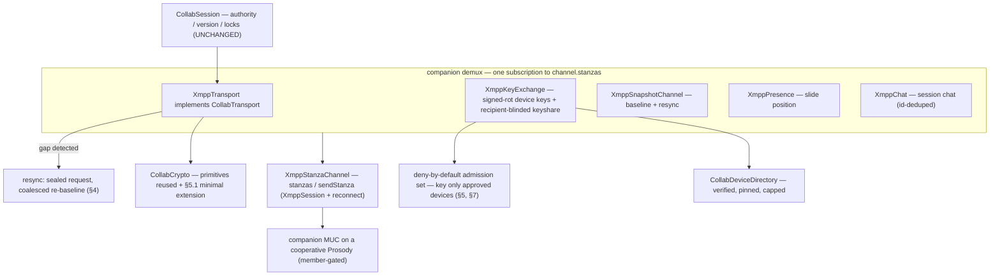

# OciDeck — XMPP CollabTransport: the collaboration data plane on the XMPP spine (Design)

> **Status:** design proposal — unbuilt (slice 2 of NATIVE_CALLS §7.1) · **Reviewed & revised:** 2026-08-08 (v3.1) · **Published by:** Stichting LibreKAT

> **A design proposal — not yet implemented.**
> This spells out **one buildable slice**: `XmppTransport implements CollabTransport`,
> the OciDeck data plane (ops, locks, presence, chat, baseline) carried over the
> **companion MUC** on the XMPP spine, so co-authoring runs on the same connection as
> the Jitsi call instead of on Matrix.
>
> It is written to be **picked up cold**: exact seams, wire shapes, the Matrix→XMPP
> mapping, the security posture, the test harness, and the open questions are spelled
> out against files that exist today.
>
> **Reviewed three times (2026-08-08).** v1 → security-architect **HERZIEN** + bewaker
> GO-with-changes → v2; a re-review → security-architect **HERZIEN (narrowly)** + bewaker **GO** → v3;
> a **confirmation** re-review → security-architect **GO-with-changes** (*v3 clears the HERZIEN*; six
> build-time refinements) + bewaker **GO** → this **v3.1**. The corrected premise across the rounds:
> **the crypto *core* is reused, but XMPP's weaker guarantees require a small, enumerated,
> chain-reviewed crypto extension** (§5.1) — not "crypto unchanged". Full trail in §12.
>
> **Siblings.** [`NATIVE_CALLS.md`](NATIVE_CALLS.md) §5 decides the single XMPP spine, §5.1 the
> companion channel; this is that doc's remaining **slice 2** (§7.1).
> [`SELF_ENCRYPTED_RELAY.md`](SELF_ENCRYPTED_RELAY.md) is the Matrix-mode data plane this mirrors
> where it can — **but not blindly** (§5.2). [`COLLABORATION.md`](COLLABORATION.md) defines the
> `CollabTransport` seam and the authority/version/lock rules that stay **unchanged** underneath.
>
> **Gated.** No new dependency (`package:xml` + `package:crypto`, both already in `pubspec`). The
> crypto extension (§5.1) touches `collab_crypto.dart` minimally and **must** clear the
> [`ketenkeuring-xmpp-spine.md`](../../assurance/ketenkeuring-xmpp-spine.md) chain-review (that is its
> red line for crypto changes), alongside a fresh bewaker + security-architect review, before it lands.

---

## 1. What this slice is (and the twice-corrected thesis)

**Is:** wiring the *existing* collaboration engine to run over XMPP. `collab_session.dart`
(authority, version rule, slide locks) already drives any `CollabTransport`; today the real remote
implementation is `MatrixRelayTransport`. This slice adds a second, `XmppTransport`, plus the
lifecycle bricks it needs, so a session can run **entirely on XMPP** — the companion MUC beside a
Jitsi call, or standalone.

**Is not:** the Jitsi media join (slice 1, F3.4b), a new session engine, or new crypto *primitives*.

**The thesis, after three review rounds.** v1 said "only the carriage changes"; that was wrong twice
over. Accurately:

> `CollabSession`, `CollabSnapshot`, the trust store, the device directory and the crypto
> **primitives** (seal/open/rekey/wrap AEAD, Ed25519, X25519) are reused. But a Matrix homeserver
> hands the data plane three things a MUC does **not**: (a) **gap-free, resumable delivery**;
> (b) **power-gated, ordered per-device state**; (c) **invite-only admission**. XMPP gives none for
> free. So this slice keeps the engine, and **adds**: a **catch-up/resync** path (§4),
> **deny-by-default admission-gated keying** (§5, §7), **directory pinning + bounds** (§5, §7), and a
> **minimal, enumerated crypto extension** (§5.1) — a signed rotation epoch, a recipient-blinded
> wrap, and mode-bound associated data. Swap the pipe, fit it, **and add three small crypto teeth**.

Parking `MatrixRelayTransport` still means **dormant, not deleted**: the relay stays the route that
co-authoring **without** a call can take with no second network stack (`http` + `cryptography`, no
XMPP client — NATIVE_CALLS §5), while XMPP mode carries co-authoring **beside a call**.

---

## 2. The reference stack, and what its server gave for free

`matrix_session_launch.dart` assembles six protocol-neutral-plus-carriage bricks sharing **one sync
loop**:

| Brick | Carries | Matrix carriage | Free from the homeserver |
|---|---|---|---|
| `MatrixRelayTransport` (`CollabTransport`) | ops, locks | timeline `nl.ocideck.op`/`.lock` (sealed) | **gap-free resumable order** via `/sync` |
| `MatrixKeyExchange` | device keys, epoch keys | device keys as **room state**; epoch key **to-device** | **power-gated, ordered** state; **at-most-once** to-device |
| `MatrixSnapshotChannel` | the baseline | timeline (chunked, sealed) | ordered delivery |
| `MatrixPresence` | who-is-on-which-slide | room state | ordered replace |
| `MatrixChat` | chat | timeline (sealed + **signed**) | at-most-once via `/sync` cursor |
| `MatrixDeviceDirectory` | verified peer keys | in-memory; ingests device state | admission via room membership |

The four "free" columns are what XMPP lacks; §4–§7 pay for them. **Warning for a cold implementer:
`MatrixKeyExchange.ensureKeyed` is fail-open** — it keys every known device unconditionally, because
Matrix admission is the room's job. Do **not** mirror that on XMPP (§5); it would hand the epoch key
to anyone who joins the URL-derivable room.

---

## 3. The wire on XMPP

**Home:** the companion MUC (`companion_room.dart`, `ocideck-<hash>@conference.<domain>`, NATIVE_CALLS
§5.1). All OciDeck occupants join it; non-OciDeck Jitsi participants are not.

**Deployment assumption.** The companion MUC needs a **cooperative or self-hosted Prosody** where
OciDeck may join, exchange messages, and **own the room** (for admission, §5). Against a
**focus-locked public Jitsi** (`meet.jit.si`, `8x8.vc`) the companion MUC does not form — there the
data plane is a **separate bring-your-own XMPP account** (NATIVE_CALLS §5). The admission requirement
(§5) raises this bar further on the most casual path; name it now, do not discover it live.

**Envelope.** `SealedEnvelope.toContent()` is a JSON-able map, so each payload rides as one child
element carrying `json.encode(sealed.toContent())` as text, in an `nl.ocideck.*` namespace:

| Data | Stanza | Element | Notes |
|---|---|---|---|
| op | `<message type=groupchat>` | `<op xmlns="nl.ocideck.op">` | ordered *for those who receive it* — delivery not guaranteed/resumable (§4) |
| lock | `<message type=groupchat>` | `<lock xmlns="nl.ocideck.lock">` | shares the send-chain with ops |
| chat | `<message type=groupchat>` | `<chat xmlns="nl.ocideck.chat">` | sealed + signed; **id = hash of `sealed.toContent()`** for dedup (§4) |
| presence (slide) | `<message type=groupchat>` | `<pos xmlns="nl.ocideck.presence">` | latest-per-sender |
| snapshot / resync | `<message type=groupchat>` | `<snap xmlns="nl.ocideck.snapshot">` | baseline + the §4 resync carrier |
| resync request | `<message type=groupchat>` | `<resync xmlns="nl.ocideck.resync">` | **sealed + admission-gated + rate-limited** (§4, N1) |
| device keys | `<presence>` on join + rotation | `<x xmlns="nl.ocideck.device">` with a **signed** `rot` epoch (§5.1) | pinned per fingerprint (§5) |
| epoch key-share | `<message type=groupchat>` | `<keyshare xmlns="nl.ocideck.keyshare">` | **recipient-blinded** (§5.1); broadcast; each occupant opens its own |

Two carriage facts (one a v1 error, corrected in v2):

- **Groupchat orders what it delivers, but delivery is neither guaranteed nor resumable.** An
  occupant briefly offline simply *misses* messages, with no `/sync`-style cursor to redeliver — so
  §4 adds catch-up/resync. (v1's "canonical, gap-free, no bookkeeping" was wrong.)
- **Presence is retained per-occupant state a newcomer receives on join** — the stand-in for Matrix
  per-device room state for device keys. But presence is **unordered and ungated** (any occupant/the
  server can emit it), so §5/§5.1 add a *signed* rotation epoch + pin-on-first-use; it is not the
  free, power-gated state Matrix had.



---

## 4. Delivery reliability: catch-up and resync

The follower rule accepts an op only at `version+1`; a gap is **dropped and the deck freezes there,
silently** (`collab_session.dart`). Matrix never bites because `/sync` redelivers; XMPP does not. So
v1's "no bookkeeping / `maxstanzas=0`" is reversed; this slice adds:

- **Reconnect/rejoin.** `xmpp_session.dart` has **none** today (`_onStreamDropped` just closes) — a
  supervised reconnect + MUC-rejoin is a **prerequisite**, shared with slice 1 (§10.5).
- **Gap detection.** A discontinuity — an op with `version > expected+1`, or a reconnect — must not
  sit frozen. (Total censorship of one op to one follower is inherent to any server-mediated
  transport, Matrix included; the next op that *does* arrive trips detection.)
- **Resync by re-baseline.** On a gap the follower emits a `<resync>` request; the authority
  re-sends the current snapshot and the follower re-bases (`rebaseTo`, forward-only, authority-sealed
  — a forged baseline fails closed). **The request is sealed, admission-gated, and rate-limited, and
  the authority coalesces concurrent requests into one broadcast** (N1: an unbounded/unauthenticated
  request would let any occupant force a deck-wide broadcast, amplified K× on concurrent reconnects).
- **MAM (XEP-0313) as the preferred catch-up where available** — the follower self-serves the gap
  from the archive without burdening the authority; needs `muc#roomconfig_enablearchiving`.
- **Idempotency.** `maxstanzas=0` is a *request* the server may ignore, and MAM/resync re-deliver.
  Ops past `version` drop safely, but chat has **no dedup** (`matrix_chat.dart`) and would double, so
  each chat message carries **`id = hash of its sealed bytes`** (`sealed.toContent()`, which include a
  fresh per-seal nonce — so a forced collision is infeasible and a replay is correctly idempotent; a
  *plaintext* hash would wrongly suppress identical text). The dedup set is **bounded** (like the
  message list).

Otherwise the push model is v1's: one demux owns the `channel.stanzas` subscription; own-echo drops
on `senderDevice == crypto.deviceId`; the serial send-chain preserves op order; the deferred backlog
drains on a key-state change, bounded by count and rounds.

---

## 5. The bricks to build

New files in `lib/xmpp/` (carriage) or reused `lib/collab/` (engine); the only `collab_crypto.dart`
change is the minimal, enumerated §5.1 extension.

1. **`xmpp_transport.dart`** — `XmppTransport implements CollabTransport`; seal + groupchat-send
   ops/locks; gap-detection → `<resync>` (§4); deferred backlog; serial send-chain.
2. **`xmpp_key_exchange.dart`** — publish device keys as a **signed-`rot` presence extension**
   (§5.1); ingest with **pin-on-first-use** (refuse a silent identity swap for a known device; accept
   a `rot` bump only if the *signed* rot strictly increases). **Keying is deny-by-default,
   admission-gated** — not the fail-open Matrix mirror (§2): `ensureKeyed` consults an approval set
   and keys **only approved devices**. The epoch key rides as a **recipient-blinded broadcast**
   `<keyshare>` (§5.1); each occupant trial-opens the one meant for it. Crypto is `CollabCrypto`
   (+§5.1).
3. **`xmpp_snapshot.dart`** — baseline chunks + the §4 resync re-baseline; buffer until keyed.
4. **`xmpp_presence_beacon.dart`** — seal the slide-id into `<pos>`; latest-per-sender.
5. **`xmpp_chat.dart`** — seal + sign + **id-dedup** (§4) `<chat>`; drop a bad signature fail-closed.
6. **`xmpp_collab_launch.dart`** — `host`/`joinXmppSession`; enforces the **admission gate** and
   XMPP-mode exclusivity (NATIVE_CALLS §1).
7. **`companion_demux.dart`** — one `channel.stanzas` subscription, fan-out by namespace.
8. **Extract `CollabDeviceDirectory`** into `lib/collab/`; the **pre-approval pin-store** is **capped
   ≥ the occupant cap** (NEW-2 — a cap *below* it would deny keying to legitimate devices; the scarcity
   gate belongs on **keying** / the approved-set, not the pin-store) **and ≤ a few device-ids per nick**
   (pinning stops *overwrite*, not *creation*, so a nick could otherwise mint unbounded ids — SA-F2);
   **pin-on-first-use**. Shared by both key exchanges.
9. **`xmpp_session.dart`** — supervised reconnect/rejoin (§4 prerequisite).
10. **`XmppMuc`** — optional `presenceExtensions` on `join()`.

**Admission gate (SA-F4 — the confidentiality boundary).** The room is derivable from the (often
public) Jitsi URL, so keying-on-presence would let anyone with the link read everything. Keying
therefore gates on a **deny-by-default approval set**: default **members-only** room owned by the
authority, **and** authority-gated keying (approve via the existing TOFU verify/fingerprint flow).
Against a hash-derived room, authority-gated keying is the part that actually holds; members-only is
the server-side reinforcement where the deployment allows it. A **build-condition**, not an open
question.

**Pinning's residual (SA-F3).** Pin-on-first-use stops a *known* device being hijacked, but the
*first* presence for a **predictable** device-id could be the attacker's (`verifyBinding` proves the
identity signs its own agreement key, not that it *owns* that device-id) — the real device is then
refused as a "swap" (targeted denial). So **unpredictable device-ids are a hard requirement** (bound
JID + random suffix — §10.6, promoted from nicety), and **out-of-band fingerprint verification +
admission are the real backstop**. Stated, not glossed.

### 5.1 The required crypto extension (chain-reviewed)

Two v2 fixes and the mode-isolation requirement each need a *small* `collab_crypto.dart` change; the
plan states them rather than pretending the crypto is untouched. Each goes through the
`ketenkeuring-xmpp-spine.md` chain-review (its red line for crypto):

- **Signed rotation epoch (N2).** `verifyBinding` today signs only `(deviceId, agreementKey)`
  (`collab_crypto.dart:218`); a `rot` field carried unsigned in presence can be replayed with
  `rot=MAX` by any occupant, permanently freezing the real device's key rotation. Fix: extend the
  identity-signed device binding to `(deviceId, agreementKey, rot)` so a rot bump is unforgeable, and
  **persist the highest-seen `rot` per device across reconnect/resync** (NEW-5) — resetting it on
  reconnect would let an older, validly-signed binding re-win "first presence".
- **Recipient-blinded wrap (N3).** `WrappedKey.toJson` emits `to`/`from` device-ids in **cleartext**
  (`collab_crypto.dart:309-310`); broadcasting it to the MUC exposes the full admitted-device set,
  the authority's id, and rekey timing to every occupant (worse than the directed model, which
  showed it only to the server). Fix: a per-epoch **opaque recipient tag** (or trial-decryption)
  instead of a cleartext id; keep the wrap authority-signed and recipient-bound.
- **Mode-bound associated data (BW-1).** The **record** AAD (`_recordAad`) binds `room`, and Matrix
  (`!local:server`) vs. companion (`ocideck-<hash>@conference.<domain>`) room strings are structurally
  disjoint, so a Matrix-mode *record* ciphertext fails to open in XMPP mode already. But the **wrap**
  AAD (`_wrapAad`) binds only `(epoch, recipient, sender)` — no `room` (NEW-3) — so a belt-and-
  suspenders `mode` tag, if the external review wants one, must go in **both** AADs. Stated as the
  reasoning **and submitted to the external crypto review to confirm** — not assumed.

**These touch a shared, already-landed core (NEW-2/B).** `collab_crypto.dart` also backs the built
Matrix path (`matrix_relay_transport`/`matrix_key_exchange`/`matrix_chat`). Extending the signed
binding from a 2-tuple to `(deviceId, agreementKey, rot)` is a **wire-format change to a shipped
verifier** — a 3-field verifier will not verify a 2-field signature — not merely "additive". So it is
a build-condition, not an afterthought: **decide whether Matrix mode adopts the new binding/wrap
format (one shared format, a coordinated bump) or the core forks per mode, and write that decision
down.** The AEAD, Ed25519 and X25519 primitives themselves are unchanged.

---

## 6. Session launch, end to end

Host: join the MUC (unique **unpredictable** nick + signed-`rot` device presence, **own the room /
members-only**) → `publishDeviceKeys` → `distributeEpoch([])` → `sendSnapshot` →
`CollabSession(isAuthority:true)`. On each **approved** newcomer → `ensureKeyed` sends the
recipient-blinded `<keyshare>`; an unapproved occupant is **not** keyed (deny-by-default).

Join: join the MUC (unpredictable nick + device presence) → `publishDeviceKeys` → wait. The demux
pins the authority's device key (signed rot), trial-opens the `<keyshare>` for it, then the snapshot;
once keyed the baseline opens and `CollabSession(isAuthority:false)` starts. **Two distinct recovery
paths — do not conflate them (NEW-6):** a drop **before keying** holds no epoch key to seal a resync
with, so it recovers by **re-join + `ensureKeyed`**; a drop **after keying** uses the sealed **§4
resync**. Both fail closed.

Root-scoped, on the same guarded `XmppSession` as the Jitsi call, XMPP-mode only (§1 exclusivity).

---

## 7. Security posture

- **Delivery reliability (SA-F1).** A gap resyncs, never freezes (§4); reconnect/rejoin is a
  prerequisite; the resync request is sealed, rate-limited, coalesced (N1). **The authority gates it
  on *current-approved-set membership*, not on decryptability (NEW-1)** — epoch keys are cumulative and
  never evicted (`collab_crypto` `_epochKeys`), so a *departed* member still holds an old epoch key and
  could seal a resync under it; an "opened, so act" gate would let an ex-member force deck-wide
  broadcasts. Ties to rekey-on-leave (§10.7).
- **Admission is the confidentiality boundary (SA-F4).** **Deny-by-default** keying — not the
  fail-open Matrix `ensureKeyed`; approve via TOFU/fingerprint; members-only where the deployment
  allows.
- **Directory integrity & bounds (SA-F2, SA-F3).** The pin-store holds **pre-approval** bindings (it
  must, to pin an identity *before* it is approved), so its cap must be **≥ the occupant cap** — not
  `≤128 < 500` (NEW-2), which would let ~43 nicks × a few ids fill it and **deny keying to legitimate
  devices** on a public room. Put the scarcity gate on **keying** (the approved-set), not on the
  pin-store; keep the per-nick id limit; **pin on first use** with a **signed** `rot` (§5.1).
  Unpredictable device-ids are required to close the first-presence race.
- **Metadata (N3).** Bounded first by admission (only approved occupants see the room), then by the
  recipient-blinded wrap (§5.1). Residuals named in the threat model, not silent (NEW-4): rekey
  **timing**, the admitted-set **cardinality** (the *number* of wrap elements), and **active senders**
  (the cleartext `sender` field on each sealed record) all stay observable to occupants.
- **Idempotency (SA-F5).** Chat dedups on `hash(sealed bytes)`, bounded set; not on `maxstanzas=0`.
- **Fail-closed everywhere.** Malformed / unknown-sender / un-openable / bad-signature / oversized →
  log + drop, never applied. Reuse the caps (frame ≤ 512 KiB, queue ≤ 256, occupants ≤ 500) + add
  per-payload, snapshot-chunk, directory, and dedup-set caps.
- **Mode-bound AAD (BW-1).** Carried by disjoint room namespaces (§5.1), **to be confirmed by** the
  external crypto review.
- **NetGuard & exclusivity (verified correct across both reviews).** `<see-other-host>` refused
  pre/post-auth; no new outbound host; same guarded session; exclusivity asserted as a test;
  media-egress out of this slice.
- **Crypto scope.** Primitives reused; the minimal §5.1 extension (signed rot, blinded wrap, mode
  AAD) is a chain-review item — the plan no longer claims "crypto unchanged".

---

## 8. Testing — two-party without a socket

A **`FakeMucHub`** (the `LoopbackHub` analogue) reflects groupchat for N members and lets a member
drop/rejoin, driving the whole data plane two-party, in-memory, wall-clock-free.

- **Unit (scripted fake channel):** seal/open round-trip; fail-closed on malformed/forged/oversized;
  deferred backlog drains on key-state; own-echo suppressed; signed-chat rejects a bad signature;
  **chat dedups a replayed sealed-id**.
- **Adversarial (from the reviews):** a **gap → resync** (drop, authority advances, rejoin →
  re-baselines, never freezes); a **known-device identity swap** refused; a **`rot`-replay** refused
  (signed rot); a **first-presence race on a predictable id** demonstrates why ids are random; a
  **directory flood** hits the cap; a **non-approved occupant is never keyed**; a **resync-flood** is
  coalesced/rate-limited; a **broadcast wrap reveals no cleartext recipient** (blinded).
- **Contract (shared):** one `CollabTransport` conformance test over Loopback, Matrix and XMPP.
- **Two-party over `FakeMucHub`:** host+guest full launch → baseline opens, an authority edit reaches
  the guest, a lock round-trips, a signed chat line arrives; a mid-join drop resyncs. Acceptance test.
- **Integration (later, shared with slice 1):** the same launch against a local `docker-jitsi-meet`
  Prosody, with a real disconnect/rejoin.
- **Performance note:** the broadcast keyshare is O(N) wraps + O(N) trial-opens per epoch — bounded by
  the occupant cap (≤ 500) and small real sessions, but measured, not assumed.
- **Mutation:** `make mutate-parsers` over the demux and the §5.1 crypto extension.

---

## 9. Files (add / touch)

```
lib/xmpp/xmpp_transport.dart          XmppTransport (ops/locks) + gap-detection→sealed resync
lib/xmpp/xmpp_key_exchange.dart       signed-rot device presence + recipient-blinded keyshare + deny-by-default admission-gated keying
lib/xmpp/xmpp_snapshot.dart           baseline chunks + resync re-baseline
lib/xmpp/xmpp_presence_beacon.dart    slide-position beacon (sealed groupchat)
lib/xmpp/xmpp_chat.dart               session chat (sealed + signed + sealed-id dedup)
lib/xmpp/xmpp_collab_launch.dart      host/joinXmppSession + admission gate
lib/xmpp/companion_demux.dart         one channel.stanzas subscription → fan-out
lib/xmpp/xmpp_session.dart            +supervised reconnect / MUC-rejoin (PREREQUISITE, shared w/ slice 1)
lib/xmpp/xmpp_muc.dart                +optional presenceExtensions on join()
lib/collab/collab_device_directory.dart  extracted; +cap (pre-approval pin-store ≥ occupant-cap, +per-nick) +pin-on-first-use +signed rot; keying-scarcity on the approved-set
lib/collab/collab_crypto.dart         MINIMAL, chain-reviewed extension: signed rot in binding; recipient-blinded wrap; (mode AAD if required)
test/xmpp/fake_muc_hub.dart           in-memory N-party MUC with drop/rejoin
```

Reused unchanged: `collab_session.dart`, `collab_snapshot.dart`, `collab_trust_store.dart`,
`deck_op.dart`, `collab_transport.dart`, `companion_room.dart`.

---

## 10. Open questions & decisions

1. **Device-key carriage — pinned, signed-`rot` presence** (SA-F3, §5.1). Safe *only* with the
   signed rot, pin-on-first-use, **unpredictable ids**, and OOB verification as the backstop. The
   residual first-presence race is real and named. Decided, with that residual explicit.
2. **Epoch key-share — recipient-blinded broadcast element** (N3, §5.1), not a directed PM (removes
   the `muc#roomconfig_allowpm`/nick-mapping dependency) and not cleartext-addressed (removes the
   admission-graph leak). The blinding scheme (opaque tag vs. trial-decrypt) is the chain-review's to
   settle.
3. **Catch-up — resync-by-re-baseline is the floor; MAM the optimisation; the request is gated**
   (SA-F1, N1). `maxstanzas=0` alone is insufficient. Decide whether v1 ships MAM or only re-baseline.
4. **Admission — a build-condition** (SA-F4): deny-by-default authority-gated keying, plus members-only
   where the deployment allows. Who owns/configures the room ties to NATIVE_CALLS §5.1 visibility.
5. **Reconnect/rejoin design** (SA-F1): backoff, rejoin, resync trigger — none exist today; shared
   with slice 1.
6. **Unpredictable nick *and* device-id derivation** (bound JID + random suffix) — a **requirement**
   now (SA-F3), not just the 409 fix; shared with slice 1.
7. **Rekey on leave (forward secrecy).** Same question in Matrix mode; answer both alike.
8. **Standalone rendezvous.** A call-less session's shared identifier stays **out-of-band and
   client-side** (no OciDeck-run directory — P1), or scope it to a separate slice.
9. **Crypto-extension scope (§5.1).** Signed rot + blinded wrap are minimal but do touch
   `collab_crypto` — a **shared, already-landed** core the Matrix path uses too, so the 2→3-field
   binding is a coordinated wire-format bump (§5.1), not a private add. The ketenkeuring chain-review
   (its crypto red line) must approve them, and the external crypto review is still **to confirm** the
   mode-AAD reasoning (in both `_recordAad` and `_wrapAad` if a `mode` tag is required). The one place
   v3 crosses into crypto — flagged, not smuggled.

---

## 11. Build order (sub-slices, each independently landable)

1. **Extract `CollabDeviceDirectory` (+ cap + per-nick + pin-on-first-use)** — shared base; hardens
   Matrix mode too. Smallest.
2. **`collab_crypto` §5.1 extension (signed rot; recipient-blinded wrap)** — behind the chain-review;
   unblocks the safe key exchange. Land with its own security-architect + bewaker sign-off.
3. **`xmpp_session` reconnect/rejoin** — the delivery-reliability prerequisite (shared with slice 1).
4. **`FakeMucHub` + `XmppTransport` (ops/locks) + gap→sealed-resync, keys pre-shared** — the sealed
   data plane two-party, including drop/rejoin and the resync-flood coalescing.
5. **`XmppKeyExchange`** (signed-rot presence + blinded keyshare + **deny-by-default admission gate**).
6. **`XmppSnapshotChannel` + `xmpp_collab_launch`** — host/join end to end over `FakeMucHub`; a
   mid-join drop resyncs. Acceptance milestone.
7. **`XmppPresence` + `XmppChat` (sealed-id dedup)** — remaining channels; §5.2 chat default.
8. **Integration on `docker-jitsi-meet`** (shared with slice 1) — the wire + a real disconnect.

After this slice, `CollabTransport` has a live XMPP implementation with the delivery, admission,
directory-integrity and metadata guarantees both reviews demanded; a session can run wholly on the
XMPP spine, and `MatrixRelayTransport` becomes a dormant-but-maintained backend (NATIVE_CALLS §7.1).

---

## 12. Revision note — 2026-08-08 review rounds

- **Round 1 (v1 → v2).** security-architect **HERZIEN** (blocking: v1's "gap-free groupchat, no
  bookkeeping" — a transient drop froze the deck permanently; plus admission-as-footnote, unbounded
  directory, last-write-wins presence, directed-PM keyshare, no chat dedup). bewaker
  **GO-with-changes** (crypto "verbatim" overstated, public-Jitsi caveat, "parking = free",
  standalone rendezvous). All folded into v2.
- **Round 2 (v2 → v3, this doc).** bewaker **GO** — all four v1 points closed; admission adds no new
  value tension (parity with Matrix, reuses TOFU, P1 intact); one §7 wording nit fixed. security-
  architect **HERZIEN, narrowly** — no v1 finding fully open, but three v2 fixes were "as-written →
  hole": **N1** an unbounded resync request → deck-wide amplification (now sealed/gated/coalesced,
  §4); **N2** an unsigned `rot` epoch → replay freezes key rotation (now signed, §5.1); **N3** the
  broadcast wrap leaked the admission graph in cleartext (now recipient-blinded, §5.1); plus the
  fail-open `ensureKeyed` mirror had to become **deny-by-default** (§5), the directory cap needed a
  number and a per-nick limit (§5), the first-presence race had to be named with **unpredictable ids**
  required (§5), and the chat id pinned to the **sealed** bytes (§4). Crucially, N2 + the mode-AAD
  requirement mean the crypto is **not** unchanged — v3 states a minimal, enumerated, chain-reviewed
  crypto extension (§5.1) instead of denying it.
- **Round 3 (v3 confirmation → v3.1).** A confirmation re-review on a separate branch. bewaker **GO**
  (confirms the v2 GO; §5.1's crypto reframe is the more honest, chain-review-conforming posture, not
  promise-erosion) — fixes: the lingering present-tense "confirms" (§10.9) and the shared-core ripple
  named (§5.1). security-architect **GO-with-changes** — **v3 clears the v2 HERZIEN**; all six new
  points are **build-time, not plan-blockers**: **NEW-1** gate resync on *approved-set membership*, not
  decryptability, since epoch keys are cumulative (§4/§7/§10.7); **NEW-2** the pre-approval pin-store cap
  must be **≥** the occupant cap, keying-scarcity on the approved-set (§5/§7); **NEW-3** only
  `_recordAad` binds `room` (§5.1); **NEW-4** name the cardinality + active-sender residuals (§7);
  **NEW-5** persist the rot high-water-mark (§5.1); **NEW-6** distinguish pre-key vs post-key recovery
  (§6). All folded into this v3.1.

Implementation still requires a fresh bewaker + security-architect review and the full
`ketenkeuring-xmpp-spine.md` build-conditions — now including the §5.1 crypto extension as an explicit
chain-review item.
