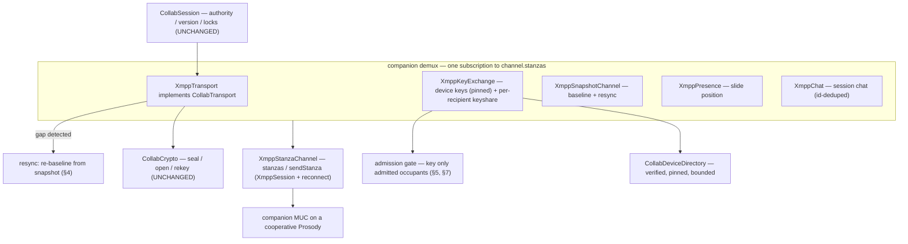

# OciDeck — XMPP CollabTransport: the collaboration data plane on the XMPP spine (Design)

> **Status:** design proposal — unbuilt (slice 2 of NATIVE_CALLS §7.1) · **Reviewed & revised:** 2026-08-08 (v2) · **Published by:** Stichting LibreKAT

> **A design proposal — not yet implemented.**
> This spells out **one buildable slice**: `XmppTransport implements CollabTransport`,
> the OciDeck data plane (ops, locks, presence, chat, baseline) carried over the
> **companion MUC** on the XMPP spine, so co-authoring runs on the same connection as
> the Jitsi call instead of on Matrix.
>
> It is written to be **picked up cold**: exact seams, wire shapes, the Matrix→XMPP
> mapping, the security posture, the test harness, and the open questions are spelled
> out against files that exist today.
>
> **Reviewed (2026-08-08).** A security-architect pass returned **HERZIEN** and a
> kernwaardenbewaker pass **GO-with-changes**; both are now folded in (see §12). The
> headline correction: XMPP's carriage is **not** a drop-in for Matrix's — a MUC does not
> give the free delivery/admission/state guarantees a homeserver does — so this slice
> reuses the engine and crypto unchanged but **adds** the delivery-reliability, admission
> and directory-integrity plumbing Matrix got from its server.
>
> **Siblings.** [`NATIVE_CALLS.md`](NATIVE_CALLS.md) §5 decides the single XMPP spine, §5.1 the
> companion channel; this is that doc's remaining **slice 2** (§7.1).
> [`SELF_ENCRYPTED_RELAY.md`](SELF_ENCRYPTED_RELAY.md) is the Matrix-mode data plane this mirrors
> where it can. [`COLLABORATION.md`](COLLABORATION.md) defines the `CollabTransport` seam and the
> authority/version/lock rules that stay **unchanged** underneath.
>
> **Gated.** No new dependency: carriage is `package:xml` + `package:crypto` (both already in
> `pubspec`); crypto is `CollabCrypto`, reused. Implementation must still clear the
> [`ketenkeuring-xmpp-spine.md`](../../assurance/ketenkeuring-xmpp-spine.md) build-conditions — including
> the **MUC + catch-up** and **mode-bound associated-data** conditions this v2 stops arguing away —
> and a fresh bewaker + security-architect review before it lands.

---

## 1. What this slice is (and the corrected thesis)

**Is:** wiring the *existing* collaboration engine to run over XMPP. `collab_session.dart`
(authority, version rule, slide locks) already drives any `CollabTransport`; today the real
remote implementation is `MatrixRelayTransport`. This slice adds a second, `XmppTransport`, plus
the lifecycle bricks it needs, so a session can run **entirely on XMPP** — the companion MUC beside
a Jitsi call, or standalone.

**Is not:** the Jitsi media join (slice 1, F3.4b), new cryptography, or a new session engine.

**The thesis, corrected after review.** The v1 claim "only the carriage changes" was too strong.
Accurately:

> `CollabCrypto`, `CollabSession`, `CollabSnapshot`, the trust store and the device directory are
> **reused unchanged**. But a Matrix homeserver hands the data plane three things a MUC does **not**:
> (a) **gap-free, resumable delivery** (`/sync` redelivers what you missed while offline);
> (b) **power-gated, ordered per-device state** (only members write it, last-writer is ordered);
> (c) **invite-only admission** by default. XMPP groupchat/presence give none of these for free. So
> this slice keeps everything above the transport, and **adds** three fittings Matrix did not need:
> a **catch-up/resync** path (§4), **admission-gated keying** (§5, §7), and **directory pinning +
> bounds** (§5, §7). Swap the pipe — but fit it.

Because transport and Matrix relay are interchangeable behind the seam, this slice is also what lets
`MatrixRelayTransport` be **parked** — meaning **dormant, not deleted**: the relay stays the route
that co-authoring **without** a call can take with no second network stack (`http` + `cryptography`,
no XMPP client — NATIVE_CALLS §5), while XMPP mode carries co-authoring **beside a call**.

---

## 2. The reference stack, and what its server gave for free

`matrix_session_launch.dart` assembles six protocol-neutral-plus-carriage bricks sharing **one sync
loop** (the transport owns it and fans out by event type):

| Brick | Carries | Matrix carriage | Free from the homeserver |
|---|---|---|---|
| `MatrixRelayTransport` (`CollabTransport`) | ops, locks | timeline events `nl.ocideck.op`/`.lock` (sealed) | **gap-free resumable order** via `/sync` |
| `MatrixKeyExchange` | device keys, epoch keys | device keys as **room state** `nl.ocideck.device`; epoch key **to-device** `nl.ocideck.keyshare` | **power-gated, ordered** per-device state |
| `MatrixSnapshotChannel` | the baseline | timeline events (chunked, sealed) | ordered delivery |
| `MatrixPresence` | who-is-on-which-slide | room state `nl.ocideck.presence` | ordered replace |
| `MatrixChat` | chat | timeline events `nl.ocideck.chat` (sealed + **signed**) | at-most-once via `/sync` cursor |
| `MatrixDeviceDirectory` | verified peer keys | in-memory; ingests device state | admission via room membership |

Trust anchor throughout: the sender is **inside the sealed envelope** (`senderDevice`), verified
against directory-held keys — never the transport's `from`. Everything is **fail-closed**. The
three "free" columns are exactly what XMPP does not provide, and §4–§7 are where this slice pays for
them.

---

## 3. The wire on XMPP

**Home:** the companion MUC (`companion_room.dart`, `ocideck-<hash>@conference.<domain>`,
NATIVE_CALLS §5.1). All OciDeck occupants join it; non-OciDeck Jitsi participants are not in it.

**Deployment assumption (was missing in v1).** The companion MUC needs a **cooperative or
self-hosted Prosody** where OciDeck may join a MUC, exchange messages, and (for admission, §5) own
the room. Against a **focus-locked public Jitsi** (`meet.jit.si`, `8x8.vc`), whose Prosody is
anonymous-auth / focus-only, the companion MUC does not form — there the data plane is a **separate
bring-your-own XMPP account**, exactly as NATIVE_CALLS §5 already states. This is a real limit on the
most casual first deployment; name it at design time, do not discover it against a live server.

**Envelope on the wire.** `SealedEnvelope.toContent()` is already a JSON-able `Map<String,Object?>`
(and `fromContent` its inverse), so each payload rides as **one child element carrying
`json.encode(sealed.toContent())` as text**, in an `nl.ocideck.*` namespace — the crypto's own
encoding travels unchanged:

```
<message type="groupchat" to="ocideck-<hash>@conference.example.org">
  <op xmlns="nl.ocideck.op">{"v":1,"ct":"…","sig":"…","sender_device":"…"}</op>
</message>
```

| Data | Stanza | Element | Notes |
|---|---|---|---|
| op | `<message type=groupchat>` to room | `<op xmlns="nl.ocideck.op">` | ordered by the room **for those who receive it** (see §4) |
| lock | `<message type=groupchat>` to room | `<lock xmlns="nl.ocideck.lock">` | shares the send-chain with ops |
| chat | `<message type=groupchat>` to room | `<chat xmlns="nl.ocideck.chat">` | sealed **and signed**; carries a **message-id for dedup** (§4) |
| presence (slide) | `<message type=groupchat>` to room | `<pos xmlns="nl.ocideck.presence">` | latest-per-sender wins |
| snapshot chunk | `<message type=groupchat>` to room | `<snap xmlns="nl.ocideck.snapshot">` | reassembled baseline; also the **resync** carrier (§4) |
| device keys | `<presence>` to room, on join + rotation | `<x xmlns="nl.ocideck.device">` with a **monotone `rot` epoch** | pinned per fingerprint (§5) |
| epoch key-share | `<message type=groupchat>` to room, **per-recipient sealed** | `<keyshare xmlns="nl.ocideck.keyshare">` | wrap is already recipient-bound; each occupant picks its own (§5) |

Two carriage facts — one of them a v1 error, now corrected:

- **Groupchat gives a single order *to those who receive a message*, but delivery is neither
  guaranteed nor resumable.** A MUC serializes messages, so no two occupants see a different order —
  but an occupant that is briefly offline simply **misses** the messages sent meanwhile, and a MUC
  has no `/sync`-style cursor to redeliver them. This is unlike Matrix, and it is why §4 adds
  catch-up/resync. (The v1 claim "canonical, gap-free, no bookkeeping" was wrong.)
- **Presence is retained, per-occupant state a newcomer receives on join** — the stand-in for
  Matrix per-device room state for **device keys**. But presence is **unordered and ungated** (any
  occupant/the server can emit it), so §5 adds pin-on-first-use + a rotation epoch; it is *not* the
  free, power-gated, ordered state Matrix had.



---

## 4. Delivery reliability: catch-up and resync (the blocking fix)

The follower rule (`collab_session.dart`) accepts an op only at `version+1`; a gap is **dropped and
the deck freezes there, silently**. On Matrix that never bites because `/sync` redelivers the gap.
On XMPP a 2-second stream hiccup while the authority sends v11–v13 leaves the follower stuck at v10
forever, with no error — and a hostile server can force it by withholding one reflection. So the v1
"no sequence bookkeeping / `maxstanzas=0`" decision is **reversed**; this slice must add:

- **Reconnect/rejoin.** `xmpp_session.dart` today has **no** reconnect (`_onStreamDropped` just
  closes the stream — verified). A supervised reconnect + MUC-rejoin is a **prerequisite**, shared
  with slice 1.
- **Gap detection.** The transport notices a discontinuity — an op with `version > expected+1`, or a
  reconnect — and does not sit frozen.
- **Resync by re-baseline.** On a detected gap the follower requests a fresh baseline; the authority
  re-sends the current snapshot (the snapshot channel already exists) and the follower re-bases at
  the current version. Heavier than incremental catch-up, but robust and server-agnostic.
- **Optional MAM (XEP-0313).** Where the room archives, query MAM since the last-seen id for
  incremental, gap-free catch-up — an optimisation over full re-baseline; requires
  `muc#roomconfig_enablearchiving`.
- **Idempotency on accumulating channels.** `maxstanzas=0` is a *request* the server may ignore, and
  MAM/resync can re-deliver; ops past `version` are already dropped safely, but **chat has no dedup**
  (`matrix_chat.dart` — verified) and would double. Every chat message carries a **message-id**
  (content hash) and is deduped on it.

The rest of the push model is unchanged from v1: one **companion demux** owns a single
`channel.stanzas` subscription and routes by kind + namespace; own-echo is dropped on
`sealed.senderDevice == crypto.deviceId`; the serial send-chain preserves op order; the deferred
backlog (events before their key) drains on a key-state change, bounded by count and rounds.

---

## 5. The bricks to build

All new files live in `lib/xmpp/` (carriage) or reuse `lib/collab/` (engine). None touch
`CollabCrypto`, `CollabSession`, `CollabSnapshot` or the trust store.

1. **`xmpp_transport.dart` — `XmppTransport implements CollabTransport`.** `participantId =
   crypto.deviceId`; seal + groupchat-send ops/locks (ops signed when `version>0`); feed opened
   ops/locks to `ops`/`locks`. Carries the deferred backlog, the serial send-chain, and **gap
   detection → resync signal** (§4).
2. **`xmpp_key_exchange.dart` — `XmppKeyExchange`.** `publishDeviceKeys()` → attach
   `<x nl.ocideck.device>` (with a monotone `rot` epoch) to the companion-room presence;
   `handleDevicePresence()` → **pin-on-first-use**: ingest a peer's keys only if the `deviceId` is
   new, or the `rot` epoch strictly increases and the identity fingerprint is unchanged — **refuse a
   silent identity swap** for a known device (this also hardens the Matrix path); the directory is
   **capped**. Epoch key-share rides as a **per-recipient-sealed `<keyshare>` groupchat element** (the
   wrap is already recipient-bound via `installEpochKey`; each occupant tries to open the one meant
   for it) — removing the directed-PM dependency and the nick↔device mapping. **Keying is
   admission-gated** (below), not automatic on presence. Crypto calls are `CollabCrypto`, unchanged.
3. **`xmpp_snapshot.dart` — `XmppSnapshotChannel`.** Chunk + seal the baseline into `<snap>`
   messages; reassemble + open; buffer until keyed. Also serves the §4 **resync** re-baseline.
4. **`xmpp_presence_beacon.dart` — `XmppPresence`.** Seal the current slide-id into a `<pos>`
   message; latest-per-sender. (Named `*_beacon` to avoid confusion with XMPP presence stanzas.)
5. **`xmpp_chat.dart` — `XmppChat`.** Seal **and sign** a chat line into a `<chat>` message with a
   message-id; accumulate; **dedup on id**; drop a bad signature fail-closed. The §5.2 default:
   OciDeck-only, E2E, in the companion room.
6. **`xmpp_collab_launch.dart` — `hostXmppSession`/`joinXmppSession`.** Mirrors
   `matrix_session_launch.dart`; enforces the **admission gate** and XMPP-mode **exclusivity**
   (NATIVE_CALLS §1).
7. **`companion_demux.dart`** — one `channel.stanzas` subscription, fan-out by namespace.
8. **Extract `CollabDeviceDirectory`** into `lib/collab/` (was in `matrix_key_exchange.dart`;
   protocol-neutral but for a stored address). Add **a size cap** and **pin-on-first-use**; both key
   exchanges share it (Matrix tests pin no-behaviour-change except the new, stricter pin/cap).
9. **`XmppMuc` extension:** optional `presenceExtensions` on `join()` (to carry `<x
   nl.ocideck.device>`); roster otherwise untouched.

**Admission gate (SA-F4 — the confidentiality boundary).** The companion room is derivable from the
(often public) Jitsi URL, so "anyone who joins and publishes a device key gets the epoch key" would
let anyone with the link read everything. Keying therefore gates on an **admission decision**, not on
bare presence: default **members-only** room with the authority as owner, **and/or** authority-gated
keying (the authority keys only occupants it has approved — reusing the existing TOFU
verify/fingerprint flow). This is a **build-condition**, not an open question. See §7.

**Crypto mode-isolation (BW-1).** `CollabCrypto` is reused as code, but the ketenkeuring requires the
associated data to be **mode-bound** so a Matrix-mode ciphertext cannot be replayed in XMPP mode. The
AAD already binds `room`, and the room namespaces are **structurally disjoint** — Matrix room ids are
`!local:server`, the companion JID is `ocideck-<hash>@conference.<domain>` — so no string collides
across modes and the `room` AAD already carries the mode separation. This slice states that reasoning
explicitly rather than calling the crypto "verbatim/unchanged", and flags it for the **external crypto
review** the ketenkeuring (condition 2) requires to confirm.

---

## 6. Session launch, end to end

Host (`hostXmppSession`): join the companion MUC (unique nick + device-key presence, **own the room /
set members-only**) → `publishDeviceKeys` → `distributeEpoch([])` (epoch 0) → `sendSnapshot` →
`CollabSession(isAuthority:true)`. On each **admitted** newcomer → `ensureKeyed` sends the current
epoch key as a per-recipient-sealed `<keyshare>`; a non-admitted occupant is **not** keyed.

Join (`joinXmppSession`): join the MUC (unique nick + device-key presence) → `publishDeviceKeys` →
wait. The demux pins the authority's device key, opens the `<keyshare>` meant for it (`installEpochKey`),
then the snapshot; once keyed, the buffered baseline opens and `CollabSession(isAuthority:false)`
starts. A mid-join stream drop triggers **reconnect + resync** (§4), not a silent hang.

Root-scoped (`meeting_session_provider.dart` region), on the **same guarded `XmppSession`** as the
Jitsi call (NATIVE_CALLS §8), XMPP-mode only (§1 exclusivity).

---

## 7. Security posture

- **Delivery reliability (SA-F1).** A gap must resync, never freeze (§4); reconnect/rejoin is a
  prerequisite. Without it a transient drop or one withheld reflection desyncs the deck permanently
  and silently.
- **Admission is the confidentiality boundary (SA-F4).** Members-only and/or authority-gated keying;
  `ensureKeyed` gates on admission, not presence. A hash-derived room off a public URL must not hand
  the epoch key to anyone who joins.
- **Directory integrity & bounds (SA-F2, SA-F3).** `CollabDeviceDirectory` is **capped** (presence is
  cheap and ungated — an occupant/server could flood fresh device ids for memory + keying
  amplification), keys only for **roster-present** nicks, and **pins on first use**: a known
  `deviceId` may rotate only via a strictly increasing `rot` epoch with an unchanged identity
  fingerprint — a silent identity swap or a replayed old presence is refused. (Hardens the Matrix
  path too.)
- **Idempotency (SA-F5).** Chat dedups on a message-id; do not rely on `maxstanzas=0`.
- **Fail-closed everywhere.** Malformed / unknown-sender / un-openable / bad-signature / oversized →
  log + drop, never applied, never wedges the stream. Reuse the caps: frame ≤ 512 KiB, frame-queue ≤
  256 (`xmpp_session.dart`), occupants ≤ 500 (`xmpp_muc.dart`); add per-payload, snapshot-chunk, and
  directory caps.
- **Mode-bound AAD (BW-1).** The `room` associated-data carries mode isolation via disjoint
  namespaces (§5); the external crypto review confirms it.
- **NetGuard & exclusivity (verified correct in v1 review).** `<see-other-host>` refused pre/post-auth,
  no new outbound host, same guarded session; exclusivity asserted as a test; media-egress out of
  this slice.
- **No new dependency; crypto reused.** `package:xml` + `package:crypto`; no SBOM change. The spine
  build-conditions (`ketenkeuring-xmpp-spine.md`: external crypto review, exclusivity-as-a-test,
  NetGuard, **MUC+catch-up**) all apply.

---

## 8. Testing — two-party without a socket

The lever: a **`FakeMucHub`** (the `LoopbackHub` analogue) implementing `XmppStanzaChannel` for N
members, reflecting groupchat in one order and letting a member drop/rejoin — so the **whole data
plane** is driven two-party, in-memory, wall-clock-free. No Prosody in the unit suite.

- **Unit (per brick, scripted fake channel):** seal/open round-trip; fail-closed on
  malformed/forged/oversized; deferred backlog drains on key-state; own-echo suppressed; signed-chat
  rejects a bad signature; **chat dedups a replayed id**.
- **Adversarial (new, from the review):** a **gap → resync** (drop member, authority advances, member
  rejoins → re-baselines, never freezes); a **presence identity-swap** is refused (pin-on-first-use);
  a **directory flood** hits the cap; a **non-admitted occupant is never keyed**.
- **Contract (shared):** one `CollabTransport` conformance test over Loopback, Matrix and XMPP.
- **Two-party over `FakeMucHub`:** host+guest full launch → baseline opens, an authority edit reaches
  the guest, a lock round-trips, a signed chat line arrives. Acceptance test; no infrastructure.
- **Integration (later, shared with slice 1):** the same launch against a local `docker-jitsi-meet`
  Prosody with two real clients, including a real disconnect/rejoin.
- **Mutation:** `make mutate-parsers` over the demux to prove the routes are tested.

---

## 9. Files (add / touch)

```
lib/xmpp/xmpp_transport.dart          XmppTransport (ops/locks) + gap-detection→resync
lib/xmpp/xmpp_key_exchange.dart       device keys (pinned presence) + per-recipient sealed keyshare + admission-gated keying
lib/xmpp/xmpp_snapshot.dart           baseline chunks + resync re-baseline
lib/xmpp/xmpp_presence_beacon.dart    slide-position beacon (sealed groupchat)
lib/xmpp/xmpp_chat.dart               session chat (sealed + signed + id-deduped)
lib/xmpp/xmpp_collab_launch.dart      hostXmppSession / joinXmppSession + admission gate
lib/xmpp/companion_demux.dart         one channel.stanzas subscription → fan-out
lib/xmpp/xmpp_session.dart            +supervised reconnect / MUC-rejoin (PREREQUISITE, shared w/ slice 1)
lib/xmpp/xmpp_muc.dart                +optional presenceExtensions on join()
lib/collab/collab_device_directory.dart  extracted; +size cap +pin-on-first-use
test/xmpp/fake_muc_hub.dart           in-memory N-party MUC with drop/rejoin
```

Unchanged and reused: `collab_crypto.dart`, `collab_session.dart`, `collab_snapshot.dart`,
`collab_trust_store.dart`, `deck_op.dart`, `collab_transport.dart`, `companion_room.dart`.

---

## 10. Open questions & decisions

1. **Device-key carriage — presence extension, now *pinned*** (SA-F3). Retained + free to newcomers;
   safe only with pin-on-first-use + a `rot` epoch. Decided.
2. **Epoch key-share — per-recipient-sealed groupchat element** (SA-F6), *not* a directed PM. Removes
   the `muc#roomconfig_allowpm` dependency and the nick↔device mapping. Decided.
3. **Catch-up — resync-by-re-baseline is the floor; MAM is the optimisation** (SA-F1). `maxstanzas=0`
   alone is insufficient. Decide whether v1 ships MAM or only re-baseline.
4. **Companion-room admission — a build-condition, not deferred** (SA-F4). Members-only vs.
   authority-gated keying vs. both; and who owns/configures the room. Resolve before build; it is the
   confidentiality boundary. (Ties to the deferred visibility decision, NATIVE_CALLS §5.1.)
5. **Reconnect/rejoin design** (SA-F1). `xmpp_session` has none today; shared with slice 1. Backoff,
   rejoin, and the resync trigger need specifying together.
6. **Unique nick derivation** (bound-JID + random suffix; the 409 in NATIVE_CALLS §7.1). Shared with
   slice 1.
7. **Rekey on leave (forward secrecy).** When a co-author leaves, does the authority start a fresh
   epoch? Same question in Matrix mode; answer both alike.
8. **Standalone rendezvous.** A call-less session needs a shared identifier; `companion_room.dart`
   derives it from a URL. Keep it **out-of-band and client-side** (no OciDeck-run directory — P1), or
   scope standalone rendezvous to a separate slice.

---

## 11. Build order (sub-slices, each independently landable)

1. **Extract `CollabDeviceDirectory` (+ cap + pin-on-first-use)** — the shared base; also hardens
   Matrix mode. Smallest, unblocks the rest.
2. **`xmpp_session` reconnect/rejoin** — the delivery-reliability prerequisite (shared with slice 1).
3. **`FakeMucHub` + `XmppTransport` (ops/locks) + gap→resync, keys pre-shared** — the sealed data
   plane driven two-party in-memory, including the drop/rejoin acceptance case.
4. **`XmppKeyExchange`** (pinned device presence + per-recipient keyshare + **admission gate**) —
   keys over the wire, safely.
5. **`XmppSnapshotChannel` + `xmpp_collab_launch`** — host/join end to end over `FakeMucHub`; the
   acceptance milestone (baseline opens; a mid-join drop resyncs).
6. **`XmppPresence` + `XmppChat` (id-deduped)** — the remaining channels; §5.2 chat default lands here.
7. **Integration on `docker-jitsi-meet`** (shared with slice 1) — the wire, and a real disconnect, against a real MUC.

After this slice, `CollabTransport` has a live XMPP implementation with the delivery, admission and
directory-integrity guarantees the review demanded; a session can run wholly on the XMPP spine, and
`MatrixRelayTransport` becomes a dormant-but-maintained backend (NATIVE_CALLS §7.1).

---

## 12. Revision note — 2026-08-08 review round

Two adversarial role reviews of the v1 plan, both folded in here:

- **security-architect — HERZIEN.** 1 blocking + 3 important + 2 small. Blocking: v1's "groupchat =
  gap-free, no bookkeeping, `maxstanzas=0`" was false — a transient drop or one withheld reflection
  freezes the deck permanently and silently, and the ketenkeuring required MUC+catch-up (§4).
  Important: room admission is the confidentiality boundary and was treated as a footnote (§5, §7);
  the device directory was unbounded (§7); presence ingest was last-write-wins, allowing a silent
  identity swap (§5, §7). Small: the directed-PM keyshare depended on MUC config → moved to a
  per-recipient-sealed groupchat element (§3, §5); chat lacked dedup (§4). Confirmed correct and
  unchanged: NetGuard posture, exclusivity-as-a-test, the `CollabCrypto` reuse.
- **kernwaardenbewaker — GO-with-changes.** No lock-in, file format untouched, no new dependency, the
  ARCHITECTURE/E2E promises already honest. Folded in: the crypto is not "verbatim" without stating the
  mode-isolation reasoning (§5); the public-Jitsi limit was missing (§3); "parking Matrix" is dormant,
  not free (§1); "standalone" needs a named out-of-band rendezvous (§10).

Implementation still requires a fresh bewaker + security-architect review and the full
`ketenkeuring-xmpp-spine.md` build-conditions.
